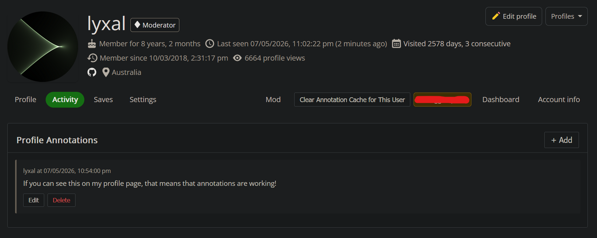

# Network Wide Profile Annotations for Moderators

Ever noticed that SE doesn't have a way for moderators to leave notes on user profiles? Well, now there is a way! (obviously not official by any means.)

> [!NOTE]
> You will obviously need to be a moderator on at least one SE site to use this script. That might have something to do with the fact it relies on interacting with a private moderator chatroom.

> [!NOTE]
> This script has the ability to send chat messages using your account. It will only do so in the annotations chatroom, and only when interacting with annotations. If you have any concerns about this, feel free to review the source code to verify that it is not doing anything nefarious.

> [!WARNING]
> This script is not (yet?) endorsed by SE, and is not affiliated with SE in any way. Use at your own risk. I don't think it should trip any API rate limits, especially given there's a bit of caching in place.

## Installation

1. Install the [Tampermonkey BETA](https://www.tampermonkey.net/index.php?locale=en) extension for your browser. Note that the BETA version is specifically required for this script to work. The regular version of Tampermonkey does not allow `GM.cookie` to read `HTTPOnly` cookies.

If you REALLY wish to use the normal version of Tampermonkey, read the "Normal Tampermonkey Instructions" below. However, I highly recommend using the BETA version if possible, for reasons mentioned in the installation instructions.

> [!WARNING]
> Using Tampermonkey BETA is **STRONGLY** recommended. Normal Tampermonkey has some limitations. Also, make sure you do not accidentally install the userscript to normal Tampermonkey. Otherwise you'll be met with never-ending `alert`s.
  
2. Click [here](https://github.com/lyxal/SE-Profile-Annotations/raw/refs/heads/main/dist/annotations.user.js) to install the userscript. You should see a popup from Tampermonkey asking if you want to install the script. Click "Install".
3. Head on over to the [Network Wide Profile Annotations chatroom](https://chat.stackexchange.com/rooms/163900/network-wide-profile-annotations) (mod-only link). This is necessary for the script to read the `acct` and `prov` cookies. These cookies allow for programmatic access to searching a private room.

Alternatively, visit any user profile page, and the script will give you an alert saying "Required cookies or fkey for network-wide annotations not found. Opening chat page to retrieve them. Please refresh this page after the values have been set.". The script will then open the chatroom for you. You can close the chatroom after that and refresh the user profile.

4. That's it! If a user has any network-wide annotations, they will show up on their profile page on any SE site.

### Normal Tampermonkey Instructions

Normal TamperMonkey is unable to retrieve the cookies needed to power annotation retrieval. This is because they are (sensibly) marked as `HTTPOnly` - normal Tampermonkey `GM.cookie.list` cannot read these cookies. As a workaround, the script will fetch the `prov` and `acct` cookies for [the dedicated annotation profile viewer account](https://codegolf.stackexchange.com/users/133667/profile-annotations-viewer) from the Annotations Chatroom.

Although there probably shouldn't be any API rate limiting, there is always a possibility of everyone making chat search requests from the same account could caus some issues. Therefore, only use normal Tampermonkey if you REALLY don't want to use the BETA version. Additionally, the cookies for the account will eventually expire, meaning I will need to update the cookies periodically. This means that there is a chance that the script could stop working until I update the cookies. Again, this is another reason why using the BETA version of Tampermonkey is recommended, as it does not have this issue (it uses your own cookies).

Regardless of which version of Tampermonkey you use, it will always use your fkey for any actions that require it (adding/editing/deleting annotations). Thankfully the fkey is not a cookie, but instead a value stored in the HTML of SE pages, so both versions of Tampermonkey can access it without issue.

Installation is otherwise the same for both versions of Tampermonkey - install the userscript, then visit the annotations chatroom to set the necessary cookies.
## Usage

Here is what annotations looks like on a user profile:

1. The `+ Add` button lets you add a new annotation.
2. The `Edit` button next to an individual annotation lets you update an annotation.
3. The `Delete` button next to an invididual annotation lets you delete an annotation.
4. The `Clear Annotation Cache for This User` button lets you clear the cached annotations for the currently viewed user.

## Contributing

If you would like to contribute to this project, the build process is very simple:

1. Make sure you have Node.js installed and `npm` available in your terminal.
2. Run `npm install` to install the dependencies.
3. Run `npx rollup -c` to build the userscript. The built script will be located at `dist/annotations.user.js`.

## Credits

- Thanks to @CPlus for the idea to (ab)use chat as a database.
